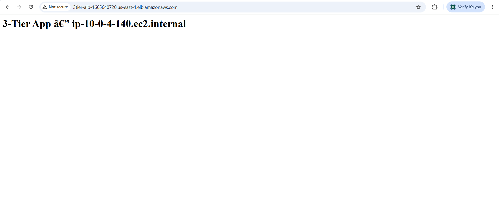
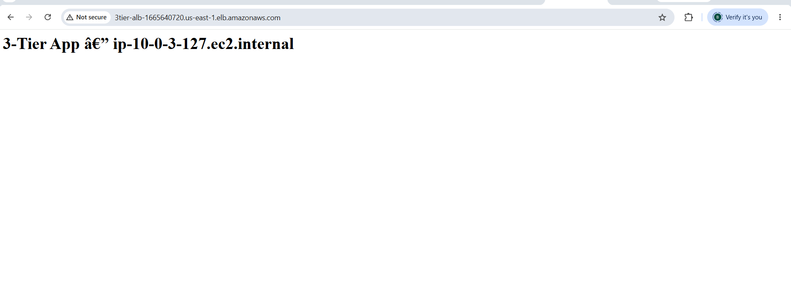

# 3-Tier AWS Architecture with Terraform

A production-pattern 3-tier infrastructure deployed on AWS using modular Terraform — Application Load Balancer, Auto Scaling Group, and Multi-AZ RDS PostgreSQL, fully isolated across public, private, and data subnets.

## Architecture

The architecture follows AWS's standard 3-tier pattern:

- **Tier 1 — Presentation:** Application Load Balancer in public subnets, the only internet-facing component
- **Tier 2 — Application:** Auto Scaling Group of EC2 instances in private subnets, reachable only through the ALB's target group
- **Tier 3 — Data:** RDS PostgreSQL in private data subnets with Multi-AZ failover, reachable only from the application tier

NAT Gateways in each public subnet give private EC2 instances outbound internet access (for package updates, etc.) without exposing them to inbound traffic.

## Proof it works

Two consecutive requests to the same ALB DNS name, routed to two different EC2 instances in two different Availability Zones — confirming the load balancer is correctly distributing traffic:

| AZ-a | AZ-b |
|---|---|
|  |  |

## What this deploys

VPC (10.0.0.0/16)

├── Public subnets   (10.0.1.0/24, 10.0.2.0/24)  → ALB, NAT Gateways

├── Private subnets  (10.0.3.0/24, 10.0.4.0/24)  → EC2 (Auto Scaling Group)

└── Data subnets     (10.0.5.0/24, 10.0.6.0/24)  → RDS PostgreSQL (Multi-AZ)

| Component | Resource |
|---|---|
| Networking | VPC, 6 subnets across 2 AZs, IGW, 2 NAT Gateways, route tables |
| Load Balancing | Application Load Balancer, Target Group, Listener |
| Compute | Auto Scaling Group (min 1, desired 2, max 4), Launch Template, target-tracking scaling policy on CPU |
| Database | RDS PostgreSQL 15, Multi-AZ, in isolated data subnets |
| State | Remote state in S3 with DynamoDB locking |

## Project structure

3-tier-archy/

├── provider.tf          # AWS provider + S3 backend config

├── main.tf               # Calls all four modules

├── variables.tf

├── outputs.tf

├── locals.tf             # Common tags, subnet CIDRs, AZs

├── terraform.tfvars      # Not committed — contains my_ip and db_password

├── docs/                 # Architecture diagram and proof screenshots

└── modules/

├── vpc/              # VPC, subnets, IGW, NAT, route tables

├── alb/               # Load balancer, target group, listener

├── asg/               # Launch template, ASG, scaling policy

└── rds/               # PostgreSQL Multi-AZ instance

## Prerequisites

- Terraform >= 1.6.0
- AWS CLI configured with valid credentials
- An existing AWS key pair (for the ASG launch template)
- An S3 bucket + DynamoDB table for remote state (see `terraform-backend` setup)

## How to deploy

```bash
terraform init
terraform plan
terraform apply
```

Get the load balancer's address after deploying:

```bash
terraform output alb_dns_name
```

Paste it into a browser. Refresh a few times — you should see the hostname change as the ALB distributes traffic across instances in both AZs.

## How to destroy

```bash
terraform destroy
```

## Real issues hit and fixed during this build

This project wasn't a clean first-try deployment — here's what actually went wrong and how it was diagnosed and fixed, because that's the part that matters more than the happy path:

1. **RDS identifier started with a digit.** AWS requires RDS identifiers to start with a letter. `project_name = "3tier"` produced `3tier-rds`, which AWS rejected. Fixed by prefixing the RDS-specific resources with `app-`.

2. **DB subnet group name had the same issue** — same root cause, same fix.

3. **`admin` is a reserved word for the PostgreSQL engine on RDS.** AWS rejected it as a master username. Changed the default to `dbadmin`.

4. **Auto Scaling Group state drift.** After the failed apply attempts above, the ASG's `desired_capacity` on AWS had drifted to `1` while Terraform's state still said `2` — meaning only one EC2 instance was actually running and the ALB had nothing else to route to. Diagnosed using `aws autoscaling describe-scaling-activities` and confirmed with `terraform apply -refresh-only`, then corrected with a normal `terraform apply` that brought real AWS state back in line with the code.

## Known limitations (this is a learning/portfolio build)

- `terraform.tfvars` stores the DB password in plaintext locally — in a real environment this would come from AWS Secrets Manager or SSM Parameter Store
- `skip_final_snapshot = true` and `deletion_protection = false` on RDS — fine for tearing down a learning environment, not appropriate for production
- SSH is not exposed on the ASG security group; access for debugging would go through AWS Systems Manager Session Manager in a real environment

## Author

Blessing — [github.com/love4jeme](https://github.com/love4jeme)
